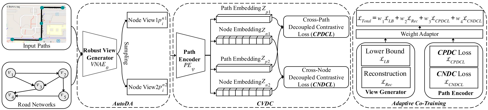

# AutoPRL: Automated Path Representation Learning via Learnable View Generator

The pytorch implementation of accepted paper "AutoPRL: Automated Path Representation Learning via Learnable View Generator"

## Framework
<div align=center>

</div>

## Environment Requirements

AutoPRL is based on Python version 3.10 and PyTorch version 1.8.1. Please make sure you have installed Python and PyTorch correctly. Then you can install other dependencies as follows:

*geographiclib==2.0

*geohash2==1.1

*geopy==2.4.1 

*haversine==2.8.1

*pandas==2.2.3 

*PyYAML==6.0.2 

*scikit_learn==1.3.0 

*scipy==1.14.1 

*Shapely==2.0.6 

*timm==0.3.2 

*torch_geometric==2.3.1 

*torchvision==0.15.2 

*tqdm==4.66.1 

*numpy==1.24 

*tensorboard


## DATA

We conduct our experiments on three trajectory datasets and corresponding road networks, including **Aalborg**, **Chengdu**, and **Harbin**. Due to privacy, we provide Chengdu ([Google Drive](https://drive.google.com/file/d/1xc1TKmEQ0VQ7daA6KVPri9J9OmsYLai_/view?usp=drive_link)) and Harbin ([Google Drive](https://drive.google.com/file/d/1TqupyC0LVqUtGfoPuXmIjm2VUke1lx0b/view?usp=drive_link)) datasets. To get path trajectory, you can refer to map matching method [FMM](https://github.com/cyang-kth/fmm). 


## Pre-Train

You can pre-train **AutoPRL** through the following commands：

```shell
python train.py 

 ## Fine-tune

We can fine-tune the model for downstream tasks based on different regressor.
