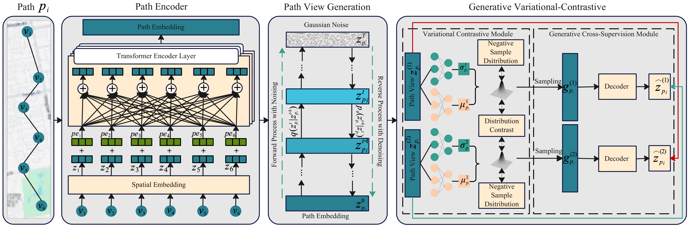

# DGCPath: Distribution-Aware Generative Contrastive Framework for Self-supervised Path Representation Learning

The pytorch implementation of accepted paper "DGCPath: Distribution-Aware Generative Contrastive Framework for Self-supervised Path Representation Learning
"

## Framework
<div align=center>

</div>

## Environment Requirements

DGCPath is based on Python version 3.10 and PyTorch version < 1.9.0. Please make sure you have installed Python and PyTorch correctly. Then you can install other dependencies as follows:

*geographiclib==2.0

*geohash2==1.1

*geopy==2.4.1 

*haversine==2.8.1

*pandas==2.2.3 

*PyYAML==6.0.2 

*scikit_learn==1.3.0 

*scipy==1.14.1 

*Shapely==2.0.6 

*timm==0.3.2 

*torch_geometric==2.3.1 

*torchvision==0.15.2 

*tqdm==4.66.1 

*numpy==1.24 

*tensorboard


## DATA

We conduct our experiments on three trajectory datasets and their corresponding road networks: Aalborg, Chengdu, and Harbin. To ensure reproducibility, the [Harbin dataset](https://drive.google.com/file/d/1TqupyC0LVqUtGfoPuXmIjm2VUke1lx0b/view) is provided here. Path trajectories can be obtained using the map-matching method FMM.[FMM](https://github.com/cyang-kth/fmm). 


## Pre-Train

You can pre-train **DGCPath** through the following commands：

```shell
python dgcpath-train.py 

 ## Fine-tune

We can fine-tune the model for downstream tasks based on different regressor.

